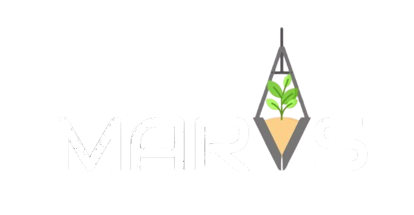
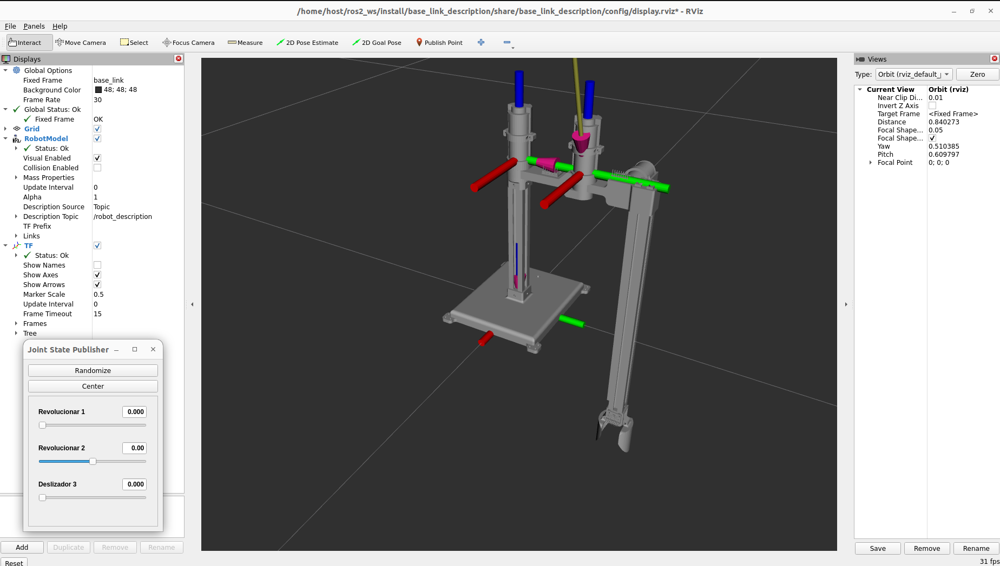

<p align="center">
  
</p>

# Introduction

This project was developed as part of an undergraduate academic assignment. The objective was to design a robotic manipulator to address a problem of the students' choosing, applying the concepts learned throughout the course.

The MARVS project is a robotic manipulator designed for planting small plants in remote areas via an autonomous robot. See more about the project on the [wiki](https://github.com/Playergeek181/marvs/wiki)

# Get started

This project leverages containerization, so having Docker installed is essential. You can follow the instructions to install Docker here.

To streamline the build and execution of the Docker container, we’ve provided scripts for building and running the container, located in the docker/scripts directory.

First, in the marvs folder, you need to build the Docker image by running the following command:

```bash
bash docker/scripts/build.sh
```
If everything goes well, you should receive: ```[xx:xx:xx][INFO] Docker image built successfully.```.

To start the container, simply run the command:

```bash
bash docker/scripts/run.sh
```

## Visualization and Simulation

### Preparing the ROS Workspace

Inside the container, the terminal will start in the `ros2_ws` directory. First, you need to build the ROS workspace by running the following command:

```bash
colcon build
```

After building, source the workspace setup file to load the environment:

```bash
source install/setup.bash
```

### Rviz

Now inside the container you have the ROS2 Humble environment, with the workspace and the marvs packages. To open the Rviz visualization, you can run this command inside the container.

```bash
ros2 launch base_link_description display.launch.py
```

You will see the Rviz representation of the robot, accompanied by a window with sliders. These sliders allow you to control the position of the end effector by adjusting the states of individual joints. An example of this setup is shown below.

<p align="center">
  
</p>
